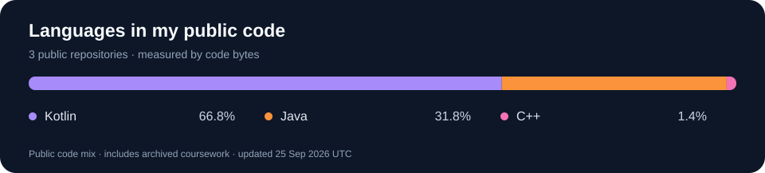

  

  <b>Computer Science diploma student · Android &amp; backend development · Malaysia</b> 
  Building practical applications with Kotlin, Java, Laravel and relational databases.

  
  

## A little about me

Hi, I'm **Amirul Harith**. I'm pursuing a **Diploma in Computer Science at International Islamic College**, with an expected graduation in **March 2027**. My interests are Android apps, backend APIs and the databases that connect them.

- **Currently focused on:** mobile development, REST API integration and relational database design.
- **Looking for:** software engineering, backend or mobile development internship opportunities.
- **Academic highlight:** Dean's List, Semester 1, Session 2025/2026.
- **Languages:** Malay (native) and English (working proficiency).

## My toolkit

  

| Area | Skills and tools |
| :--- | :--- |
| Programming | Kotlin, Java, C++, PHP, JavaScript, SQL, HTML, CSS |
| Android | Android Studio, XML layouts, Retrofit, mobile and backend integration |
| Backend | Laravel, REST APIs, MVC architecture, CRUD development |
| Databases | PostgreSQL, MySQL, SQLite, Microsoft Access, pgAdmin, relational database design |
| Development tools | Git, GitHub, Postman, XAMPP, Visual Studio Code |

These are technologies I've used through coursework and projects; I'm continuing to build depth through hands-on development.

## Featured projects

### 🐾 [PawCare](https://github.com/Tendo505/PawCare)
**Pet health management · Kotlin · Laravel · PostgreSQL · REST APIs**

A pet-care project covering pet profiles, health records, vaccinations, appointments and reminders. My work includes relational database design, Laravel MVC and CRUD services, and connecting the Android app to backend APIs using Retrofit.

### 📱 [PhoneMarketTracker](https://github.com/Tendo505/PhoneMarketTracker)
**Android phone-shop interface · Java · XML · Android Studio**

The current public version demonstrates sign-in and sign-up screens, a product menu, a sales overview chart and cart navigation, with basic form validation. It is a front-end demonstration; authentication and persistent storage are not implemented in this published version.

### 🎓 Student Club Management System
**Group coursework · PHP · MySQL · HTML/CSS · XAMPP**

Member-management workflows with create, read, update and delete operations, required-field validation and unique student IDs.

## Languages in my public code

<!-- LANGUAGE_DATA_START -->
**Kotlin 54.5%** · **Java 44.4%** · **C++ 1.1%**
<!-- LANGUAGE_DATA_END -->

Calculated from GitHub's language byte counts across public, non-fork repositories, including archived coursework and excluding this profile repository. These percentages describe repository contents, not proficiency or personal authorship. GitHub may omit markup, generated or vendored files. The card refreshes daily, and some skills above may not appear in public repositories.

---

<b>Interested in my work?</b> Explore the projects above or browse <a href="https://github.com/Tendo505?tab=repositories">all my public repositories</a>.

Skill icons by <a href="https://github.com/tandpfun/skill-icons">Skill Icons</a> · Badges by <a href="https://github.com/badges/shields">Shields</a> · Language card generated in this repository.
